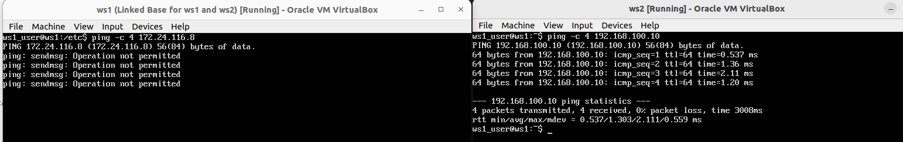
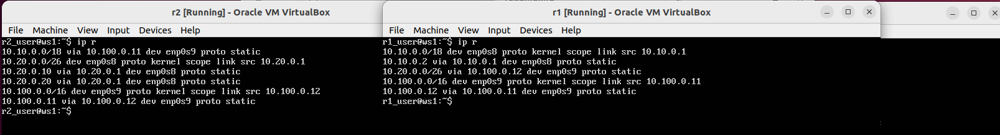

## Part 1. Инструмент ipcalc

## 1.1. Сети и маски
- установка ipcalc

 \
Вывод установки

- 1) адрес сети 192.167.38.54/13
 \
Вывод 

- 2) 

	* перевод маски 255.255.255.0 в префиксную и двоичную запись

	 \
	префикс /24 и двоичную запись

	* /15 в обычную и двоичную

	 \
	обычная и двочная  

	* 11111111.11111111.11111111.11110000 в обычную и префиксную
	
	 \
	в обычную и префиксную

- 3) минимальный и максимальный хост в сети 12.167.38.4 при масках

	* /8
	
	 \
	минимальный и максимальный хост в сети при соответствующей маске
	
	* 11111111.11111111.00000000.00000000
	
	 \
	минимальный и максимальный хост в сети при соответствующей маске

	* 255.255.254.0
	
	 \
	минимальный и максимальный хост в сети при соответствующей маске
	
	* /4
	
	 \
	минимальный и максимальный хост в сети при соответствующей маске
	
## 1.2. localhost

- Локал хост начинается с 127. Это выделенный диапазон адресов. Соответственно в 99% случаев адреса localhost в диапазоне 127.0.0.1 — 127.255.255.254. 

	* Чтобы наверняка убедитсья можно использвоать утилиту whois которая покажет инфу про ip. 
	
	 \
	whois 194.34.23.100
	
	 \
	whois 127.0.0.1

	 \
	whois 127.0.0.2

	 \
	whois 128.0.0.1
	
	* исходя из данных выше можно обратиться к приложению, работающему на 127.0.0.1 и 127.0.0.2
 
 
 
## 1.3. Диапазоны и сегменты сетей

- 1) какие из перечисленных IP можно использовать в качестве публичного, а какие только в качестве частных?
	частные: 10.0.0.45, 10.10.10.10, 172.20.250.4, 172.16.255.255, 192.168.4.2, 
	публичные: 134.43.0.2, 172.0.2.1, 192.172.0.1, 172.68.0.2, 192.169.168.1

- 2) какие из перечисленных IP адресов шлюза возможны у сети 10.10.0.0/18:
	ько теч то находятся в диапазоне   minHost-maxHost: 10.10.0.2, 10.10.10.10, 10.10.1.255
 	 \
	ipcalc 10.10.0.0/18
---
## Part 2. Статическая маршрутизация между двумя машинами

- Поднять две виртуальные машины (далее -- ws1 и ws2)

 	 \
	две виртуальные машины
	

- С помощью команды ip a посмотреть существующие сетевые интерфейсы

 	 \
	ws1 ip
	
 	 \
	ws2 ip
	
- Описать сетевой интерфейс
 	 \
	yaml
	
- Выполнить команду netplan apply для перезапуска сервиса сети
 	 \
	netplan apply
	
## 2.1. Добавление статического маршрута вручную

- Добавить статический маршрут от одной машины до другой и обратно	

 	 \
 	статический маршрут команда
 
- Пропинговать соединение между машинами

 	 \
	пропинговка статического соединения
	
- Добавить статический маршрут от одной машины до другой с помощью файла etc/netplan/00-installer-config.yaml

 	 \
	скрин с содержанием изменённого файла etc/netplan/00-installer-config.yaml
	
- Пропинговать соединение между машинами

 	 \
 	скрин с вызовом и выводом использованной команды

	
---
## Part 3. Утилита iperf3

- 3.1. Скорость соединения
	* 8 Mbps = 1 MB/s
	* 100 MB/s = 100000 Kbps
	* 1 Gbps = 1000 Mbps

- 3.2. Утилита iperf3

 	 \
	с ws1 к ws2
	
 	 \
 	с ws2 к ws1

---
## Part 4. Сетевой экран

- скрины с содержанием файла /etc/firewall для каждой машины.

 	 \
	содержанием файла /etc/firewall для каждой машины

- Запустить файлы на обеих машинах командами chmod +x /etc/firewall.sh и /etc/firewall.sh

 	 \
	скрины с запуском обоих файлов
	
- разницу между стратегиями, применёнными в первом и втором файлах

	ВСегда в приоритете первое правило.
	
	* ws1 первым правилом блокирует все исходящие пакеты протокола ICMP типа 8 (ICMPv4 echo request).

	* ws2 первым правилом для разрешения прохождения пакетов протокола ICMP типа 8.
	
- 4.2. Утилита nmap

 	 \
 	пингуется с ws2, на ws1 запрещена передача пакетов
 	
  	 \
  	host is up

## Part 5. Статическая маршрутизация сети

- Поднять пять виртуальных машин

  	 \
	пять виртуальных машин
	
- 5.1. Настройка адресов машин

	* Настроить конфигурации машин
  	 \
  	r1 r2 *.yaml

  	 \
  	ws1 *.yaml

  	 \
  	ws21 ws22 *.yaml

	* Перезапустить сервис сети. Если ошибок нет, то командой ip -4 a проверить, что адрес машины задан верно. Также пропинговать ws22 с ws21. Аналогично пропинговать r1 с ws11.
  	
  	 \
  	r1 pings
	
	 \
	ws11 pings
    	
	 \
  	r2 - r1 pings
	
	 \
  	r2 - ws21 r2 - ws22 pings  	

	 \
  	ws21 - r2 ws22 - r2 pings  	

- 5.2. Включение переадресации IP-адресов.

	* включения переадресации IP
	
	 \
	sysctl -w net.ipv4.ip_forward=1 r1 r2
	
  	* Откройте файл /etc/sysctl.conf и добавьте в него
  	
	 \
	net.ipv4.ip_forward = 1 r1 r2
	
- 5.3. Установка маршрута по-умолчанию

	* Настроить маршрут по-умолчанию (шлюз) для рабочих станций. Для этого добавить default перед IP роутера в файле конфигураций
	
	 \
	.yaml ws11 ws21 ws22
	
	* Вызвать ip r и показать, что добавился маршрут в таблицу маршрутизации
	
	 \
	ip r ws11 ws21 ws22
	
	* Пропинговать с ws11 роутер r2 и показать на r2, что пинг доходит. Для этого использовать команду: tcpdump -tn -i eth1
	
	 \
	tcpdump -tn -i enp0s9
	
- 5.4. Добавление статических маршрутов

- Добавить в роутеры r1 и r2 статические маршруты в файле конфигураций. 

	 \
	статические маршруты в файле конфигураций
	
- Вызвать ip r и показать таблицы с маршрутами на обоих роутерах.

	 \
	скрин с вызовом и выводом использованной команды
	
- Запустить команды на ws11:
	'''bash
	ip r list 10.10.0.0/[маска сети] и ip r list 0.0.0.0/0
	'''
	
	 \
	ip r list 10.10.0.0/[маска сети] и ip r list 0.0.0.0/0

- Маршрут 10.10.0.0/18 не попадает под маршрут по умолчанию 0.0.0.0/0, так как он имеет более специфический префикс.
	Маршруты в CIDR нотации представляют собой пары из префикса и маски, разделенных точкой. Префикс - это часть IP-адреса, которая остается без изменений при направлении пакета к цели, а маска - количество битов, которые должны быть совместимы между префиксом и адресом цели для того, чтобы соответствовать маршруту.
	В случае с маршрутом 0.0.0.0/0, префикс равен 0.0.0.0, а маска - 0. Это означает, что любой IP-адрес может соответствовать этому маршруту.
	С другой стороны, маршрут 10.10.0.0/18 имеет префикс 10.10.0.0 и маску 18. Таким образом, только адреса, начинающиеся с 10.10.0.0 и имеющие 18 bits совпадения с префиксом, соответствуют этому маршруту.
	Таким образом, маршрут 10.10.0.0/18 является более специфическим, чем маршрут 0.0.0.0/0, и будет использоваться вместо него, когда возникнет необходимость переслать пакеты в диапазоне 10.10.0.0/18.

- 5.5. Построение списка маршрутизаторов

	 \
	ввод tcpdump -tnv -i enp0s3

	 \
	скрины с вызовом и выводом использованных команд (tcpdump и traceroute).

	* объяснить принцип работы построения пути при помощи traceroute
	Traceroute - это утилита, которая используется для определения маршрута пакетов в сети. 					Она работает за счет отправки специальных пакетов, называемых пробными пакетами (probe packets), через сеть и последующего анализа ответов на эти пакеты.
	Принцип работы traceroute основан на том, что каждый хост в сети имеет уникальный адрес, который можно использовать для идентификации его местоположения. Когда traceroute отправляет пробный пакет через сеть, он добавляет к нему информацию о своем собственном IP-адресе и ожидает ответа от других хостов в сети.
	Когда пробный пакет достигает следующего хоста по маршруту, тот отправляет обратно ответный пакет, содержащий информацию о своем IP-адресе и времени, необходимом для того, чтобы переслать пакет дальше. Traceroute анализирует этот ответ и может определить, какой хост является следующим пунктом на маршруте.
	Тraceroute повторяет этот процесс, отправляя новые пробные пакеты через предыдущий хост, пока не будет получен ответ от последнего хоста в маршруте
	
- 5.6. Использование протокола ICMP при маршрутизации

	Запустить на r1 перехват сетевого трафика. Пропинговать с ws11 несуществующий IP (например, 10.30.0.111) с помощью команды: ping -c 1 10.30.0.111
	
	 \
	ввод tcpdump -tnv -i enp0s3
	скрин с вызовом и выводом использованных команд.

---
## Part 6. Динамическая настройка IP с помощью DHCP

- 1) указать адрес маршрутизатора по-умолчанию, DNS-сервер и адрес внутренней сети

	 \
	/etc/dhcp/dhcpd.conf конфигурацию службы DHCP файла для r2

- 2) в файле resolv.conf прописать nameserver 8.8.8.8.

	 \
	resolv.conf
	
- Перезагрузить службу DHCP командой systemctl restart isc-dhcp-server. Машину ws21 перезагрузить при помощи reboot и через ip a показать, что она получила адрес. Также пропинговать ws22 с ws21.

	 \
	new ip

	 \
	ping ws21 -> ws22
	
- Указать MAC адрес у ws11, для этого в etc/netplan/00-installer-config.yaml надо добавить строки: macaddress: 10:10:10:10:10:BA, dhcp4: true

	 \
	ws11 etc/netplan/00-installer-config.yaml.
	
- Для r1 настроить аналогично r2, но сделать выдачу адресов с жесткой привязкой к MAC-адресу (ws11). Провести аналогичные тесты

	 \
	new ip

- Запросить с ws21 обновление ip адреса

	 \
	old ip ws21

	 \
	new ip ws21

	sudo dhclint -r enp0s8 удаляет IP, выполняет освобождение IP-адреса, полученного от DHCP-сервера, на указанном интерфейсе \
	sudo dhclint  enp0ы8 назначает IP

## Part 7. NAT

- В файле /etc/apache2/ports.conf на ws22 и r1 изменить строку Listen 80 на Listen 0.0.0.0:80, то есть сделать сервер Apache2 общедоступным

	 \
	Listen 0.0.0.0:80
	
- Запустить веб-сервер Apache командой service apache2 start на ws22 и r1

	 \
	service apache2 start на ws22 и r1

- Добавить в фаервол, созданный по аналогии с фаерволом из Части 4

	 \
	bash /etc/firewall.sh 

- Проверить соединение между ws22 и r1 командой ping

	 \
	ping r1 -> ws22

- Добавить в файл ещё одно правило: разрешить маршрутизацию всех пакетов протокола ICMP

	 \
	firewall.sh 4

- Проверить соединение между ws22 и r1 командой ping

	 \
	ping r1 -> ws22 4
	
- Добавить в файл ещё два правила Запускать файл также, как в Части 4

	 \
	firewall.sh 56

- Проверить соединение по TCP для SNAT, для этого с ws22 подключиться к серверу Apache на r1

	 \
	telnet 10.100.0.11 80
	
- Проверить соединение по TCP для DNAT, для этого с r1 подключиться к серверу Apache на ws22 командой telnet

	 \
	telnet 10.20.0.20 8080

## Part 8. Дополнительно. Знакомство с SSH Tunnels

- Запустить на r2 фаервол с правилами из Части 7

	 \
	firewall.sh

- Запустить веб-сервер Apache на ws22 только на localhost

	 \
	localhost:80

- Воспользоваться Local TCP forwarding с ws21 до ws22, чтобы получить доступ к веб-серверу на ws22 с ws21

	 \
	sudo ssh -L 9999:10.20.0.20:80 ws22_user@10.20.0.20 позволяет подключиться к виртуальной машине ws22

	 \
	авторизованный ws22_user на машие  ws21

- Воспользоваться Remote TCP forwarding c ws11 до ws22, чтобы получить доступ к веб-серверу на ws22 с ws11

	 \
	ssh -R 9999:10.20.0.20:80 ws22_user@10.20.0.20
	
- Для проверки, сработало ли подключение в обоих предыдущих пунктах, перейдите во второй терминал (например, клавишами Alt + F2) и выполните команду:

	 \
	telnet

